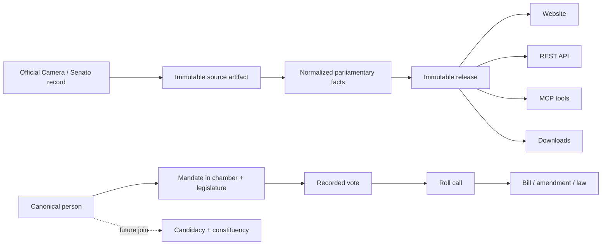

# Policy Data Italia

[](https://github.com/aethon-lab/policy-data/actions/workflows/ci.yml)
[](LICENSE)
[](https://policy-data.lapolazzati.com)

Open, source-backed data about how Italy's Parliament votes—built for people,
journalists, researchers, and software agents.

The first release covers named and electronic plenary roll calls in the **XIX
Legislature** from both the **Camera dei deputati** and the **Senato della
Repubblica**. Every published fact keeps a path back to the official record.

> This is an independent civic-data project. It is not affiliated with, or
> endorsed by, the Italian Parliament.

## What you can do

- Search a politician and inspect their recorded votes.
- Find everyone who voted for, against, or abstained on a measure.
- Follow a roll call back to the official parliamentary source and related law.
- Download immutable, checksummed data releases.
- Query the same data through a REST API or a remote MCP server.
- Build future election and constituency tools on stable person identifiers.

The long-term question behind the project is simple:

> Who asking for my vote has already voted on the issues I care about?

Policy Data separates parliamentary history from election data. A future
candidacy can attach to the canonical `person_id`, so questions such as
“Which candidates in my district voted for Superbonus?” do not require rewriting
the underlying vote record.

## Try it

| Surface | URL |
| --- | --- |
| Public website | <https://policy-data.lapolazzati.com> |
| Human documentation | <https://policy-data.lapolazzati.com/docs> |
| OpenAPI | <https://policy-data.lapolazzati.com/openapi.json> |
| MCP guide | <https://policy-data.lapolazzati.com/docs/mcp> |
| Agent index | <https://policy-data.lapolazzati.com/llms.txt> |
| Dataset status | <https://policy-data.lapolazzati.com/dati> |

REST and MCP use the same bearer API key. Request an emailed access code in the
dashboard, then create a key that is displayed once.

```sh
curl "https://policy-data.lapolazzati.com/api/v1/roll-calls?limit=25" \
  -H "Authorization: Bearer $POLICY_DATA_API_KEY"
```

Agents should read `llms.txt`, use API or MCP for data, and avoid scraping HTML.

## Data model



Three rules protect historical accuracy:

1. A person is independent of their chamber, legislature, and political group.
2. Group membership is dated; current affiliation never overwrites history.
3. Official observations, normalized facts, derived metrics, and interpretation
   remain separate layers.

Start with the [domain model](docs/domain-model.md) and
[data dictionary](docs/data-dictionary.md). The SQL schema is in
[`src/policy_data/storage/schema.sql`](src/policy_data/storage/schema.sql).

## Official sources and provenance

The ingestion adapters acquire data from the official open-data services of the
Camera and Senato. Raw responses are stored by content hash. A release is only
published after reconciliation checks, and every exposed fact links to an exact
source record.

Source data retains the attribution and licensing terms of its publisher. A
release manifest records acquisition time, source URL, artifact digest, schema
version, row counts, and export checksums. Unknown source values fail closed or
are quarantined instead of being silently guessed.

See [`config/sources.toml`](config/sources.toml) for the source registry and
[`docs/runbooks/refresh.md`](docs/runbooks/refresh.md) for the refresh process.

## Run locally

Requirements: Python 3.13 and [uv](https://docs.astral.sh/uv/).

```sh
git clone https://github.com/aethon-lab/policy-data.git
cd policy-data
uv sync --frozen --all-groups
uv run pytest -q
uv run uvicorn policy_data.runtime:app --reload
```

The production image and Compose definitions are deliberately separate from the
development environment:

```sh
cp deploy/.env.example deploy/.env
docker compose --env-file deploy/.env \
  -f deploy/compose.yml -f deploy/compose.loopback.yml config --quiet
```

Do not expose the application container directly to the internet. Put it behind
a trusted reverse proxy that terminates TLS and preserves authorization and MCP
headers. The [Catone deployment runbook](docs/runbooks/deploy-catone.md) explains
the production layout.

## Repository map

| Path | Purpose |
| --- | --- |
| `src/policy_data/domain/` | Canonical identities, votes, items, provenance |
| `src/policy_data/sources/` | Official Camera and Senato adapters |
| `src/policy_data/ingest/` | Validation, release building, exports |
| `src/policy_data/query/` | Release-pinned read model and pagination |
| `src/policy_data/api/` | REST contracts and error responses |
| `src/policy_data/mcp/` | Read-only MCP tools for agents |
| `src/policy_data/web/` | Public site, docs, and access dashboard |
| `deploy/` | Hardened Docker Compose deployment |
| `docs/` | Model, dictionary, plans, and operations |
| `tests/` | Unit, integration, contract, and official-refresh tests |

## Project status

The platform is an early public release. XIX Legislature ingestion and the
read-only query surfaces are implemented. Earlier legislatures, electoral
candidacies, constituency matching, policy categories, and impact analysis are
planned extensions—not inferred data in the current release.

Data freshness and completeness belong in the product, not in a README that can
go stale. Check the live [dataset status](https://policy-data.lapolazzati.com/dati)
and each release manifest before drawing conclusions.

## Contributing

Corrections, source-adapter improvements, documentation, accessibility work,
and independent validation are welcome. Read [CONTRIBUTING.md](CONTRIBUTING.md)
before opening a pull request. Please report security issues privately according
to [SECURITY.md](SECURITY.md), and follow our [Code of Conduct](CODE_OF_CONDUCT.md).

## License

The software is licensed under
[AGPL-3.0-or-later](LICENSE). Official-source data and generated releases retain
their publishers' attribution and applicable terms; the software license does
not replace those terms.
