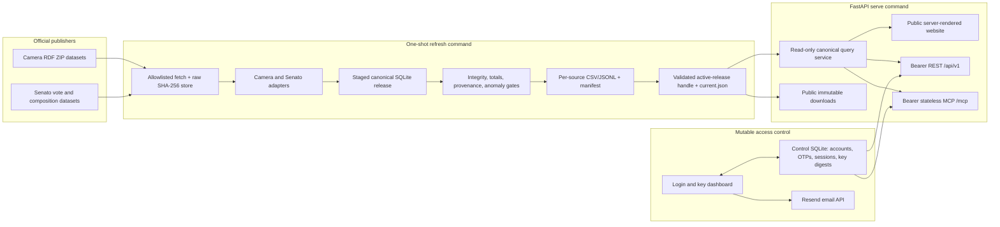

# Italian Parliamentary Roll-Call Platform - Plan

## Goal Capsule

Build and deploy the first public release of an open-source Italian parliamentary data platform in seven days. The release covers the XIX Legislature in both the Camera dei deputati and the Senato della Repubblica. It lets people and agents answer who voted for what through one public website, one REST API, one MCP server, and reproducible downloads.

The implementation must optimize for source fidelity and future legislature expansion. Official records remain distinguishable from normalized facts. Missing source data never becomes a political inference.

Authority order:

1. The session-settled product decisions and Requirements in this plan.
2. The official Camera and Senato datasets, licenses, and identifiers.
3. The Key Technical Decisions in this plan.
4. Implementation details that the plan leaves open.

Execution profile: one side-project team or autonomous implementation session, seven calendar days, greenfield repository, one production host, and no paid product features.

Stop and surface a blocker instead of substituting data when:

- Catone cannot retrieve an official required dataset and no documented official distribution works.
- A source cannot be reconciled to its published totals or identifiers.
- A source license cannot be represented without obscuring attribution or ShareAlike obligations.
- Catone access, DNS/TLS, or a verified Resend sending domain is unavailable at the deployment gate.

Tail ownership: the executor owns implementation, fixture capture, validation, Catone deployment, smoke testing, and rollback proof. The plan file remains a decision artifact and is not used as a progress tracker.

## Product Contract

### Summary

The first release is a legislature-aware public record of official plenary roll-call votes. It starts with the XIX Legislature and both chambers. The same normalized facts power human pages, REST, MCP, and downloads. The schema and identifiers permit older legislatures to be added without replacing the public contract.

The website remains publicly browsable. REST and MCP use the same bearer API key. A user signs in to the dashboard with a short email code delivered by Resend, then creates or revokes keys.

### Problem Frame

Official Italian parliamentary data is split across two publishers, formats, identifiers, and status vocabularies. Existing accountability products add useful interpretation, but agents and developers still lack a small, provenance-first, cross-chamber contract that can be reproduced and extended backward by legislature.

The phrase “all votes” is easy to overstate. The official structured sources cover plenary electronic or named roll calls. Some parliamentary decisions are not recorded individually, and secret votes cannot expose member positions. The product must show those limits instead of manufacturing completeness.

### Product Key Decisions

- Start with the current XIX Legislature, then backfill earlier legislatures through the same source registry and canonical model.
- Cover both Camera and Senato from the first release. Senato-only coverage is not an acceptable MVP.
- Include every roll call published by the official vote catalogues and their official detail records, not only final votes or editorially selected “key votes.”
- Keep public browsing and downloads open. Require one bearer API key for both REST and MCP.
- Use Resend email codes for dashboard login. The dashboard creates and revokes API keys; email does not carry a permanent API key.
- Link official patrimonial documents when present. Do not parse, mirror, rank, or infer financial facts in this release.
- Deploy as a dedicated Docker Compose project on Catone.

### Actors

- A1. A citizen, journalist, or researcher browses politicians, groups, votes, positions, source records, and disclosure links without an account.
- A2. A developer or AI agent obtains an API key and queries the same data through REST or MCP.
- A3. An operator refreshes official sources, reviews failed imports, promotes or rolls back releases, and maintains the Catone deployment.
- A4. A future contributor adds an older legislature or a new official relationship without redesigning the core entities.

### Requirements

#### Coverage and factual integrity

- R1. Ingest every roll call published in the official XIX Legislature vote catalogues for both Camera and Senato, including amendment, article, procedural, confidence, and final votes when present; use Camera’s official electronic-vote detail pages to complete member positions that are absent from its RDF distribution.
- R2. Describe coverage as official plenary electronic or named roll calls; do not claim coverage of secret individual choices, unrecorded proceedings, or committee activity not present in the source datasets.
- R3. Store each published individual position with its raw source value and a normalized value from `yes`, `no`, `abstain`, `present_not_voting`, `did_not_vote`, `not_participating`, `mission`, `leave`, `leave_or_mission`, `requester_not_voting`, `presiding`, `not_in_office`, `secret_participation`, `absent_explicit`, `not_recorded`, or `unknown`.
- R4. Store only source-observed positions in `member_vote`. When positions are published and an unambiguous active mandate has no observed row, the query layer may emit a separately labeled `not_recorded` gap with its eligibility diagnostic; it never converts that gap to absence or creates chamber-wide gaps when positions are unavailable.
- R5. Resolve parliamentary group at vote time from official membership intervals. A gap, overlap, or ambiguous same-day change returns no group plus a diagnostic state; it never falls back to the current group.
- R6. Link every exposed normalized entity or fact to exact `source_record` entries that identify the source artifact, upstream URI or key, record locator, observed time, raw scope, mapping version, and resolution rule; derive publisher and license through that lineage.
- R7. Reconcile normalized roll-call totals to official totals where supplied and quarantine a release when hard invariants fail.
- R8. Store patrimonial-document references as nullable source links with their official label or year, source page, and observation time. Missing means “not currently linked by the source.”

#### Expandable canonical model

- R9. Make legislature and chamber first-class dimensions on mandates, groups, sittings, roll calls, positions, and source identities.
- R10. Separate a chamber- and legislature-independent canonical person from one or more authority-scoped source identities. Merge only through a reviewed, versioned crosswalk with a named survivor and permanent aliases; treat `owl:sameAs` as evidence, not automatic authority.
- R11. Model a roll-call subject as a typed, source-addressable parliamentary item, give each roll-call/item link an explicit role and raw source predicate, and support typed item-to-item relations so bills, amendments, articles, motions, and later full-text records can attach without changing the roll-call identity.
- R12. Separate source facts, normalized facts, derived metrics, and interpretation. The XIX release exposes only source and normalized facts.
- R13. Use entity-specific stable ID recipes: canonical person IDs are independent of chamber and legislature; source-identity IDs use the minimum authority scope needed to disambiguate the upstream key; roll calls, mandates, groups, and sittings retain chamber and legislature scope. Database sequences and display slugs are not public identities.
- R14. Adding an earlier legislature may add source configuration, mappings, and rows, but must not require a new public ID shape or a breaking REST/MCP contract.

#### Public and agent-facing surfaces

- R15. Provide public Italian-language pages for home, politicians, politician detail, roll calls, roll-call detail and positions, groups, data status, downloads, API docs, MCP docs, login, dashboard, privacy, and source licensing.
- R16. Provide a versioned REST API under `/api/v1` for legislatures, people, groups, roll calls, member positions, dataset status, and disclosure links. Every collection uses deterministic cursor pagination with a default of 25 and maximum of 100.
- R17. Provide MCP tools for listing legislatures, searching and retrieving people, searching and retrieving roll calls, listing a person’s votes, listing a roll call’s member positions, listing groups, and reading dataset status.
- R18. Make website, REST, and MCP use the same canonical query service. Prebuilt downloads use the same immutable release, stable-ID serializer, enums, lineage, and schema-versioned export contract without calling the runtime query service.
- R19. Publish `/openapi.json`, interactive API docs, `/docs/mcp`, `/llms.txt`, `/robots.txt`, `/sitemap.xml`, immutable release manifests, source-separated compressed CSV and JSONL downloads, and a public health response.
- R20. Include `release_id`, `data_through`, and applicable source licenses in collection responses and MCP results. Bind opaque cursors to `release_id` so pagination cannot mix releases.

#### Access and privacy

- R21. Let a user request a one-time login code by email, verify it atomically, establish a secure dashboard session, and create, label, view metadata for, and revoke only that account’s API keys. Account ownership is derived from the session, never a request-supplied account ID.
- R22. Deliver login codes through Resend with a verified sending domain and an idempotency key. Use a high-entropy challenge ID, permit at most one active challenge per normalized email, expire it after ten minutes, allow at most five attempts globally under concurrency, and consume it in the same transaction that issues one session.
- R23. Show each raw API key once. Store only an indexed prefix and a keyed digest. Use the same `Authorization: Bearer` key for REST and MCP.
- R24. Keep public pages, docs, health, manifests, and downloads unauthenticated. Return RFC 9457 problem responses for missing, invalid, revoked, or rate-limited API keys on REST; return protocol-appropriate MCP errors on MCP.
- R25. Rate-limit code requests by normalized email and source IP, code verification by challenge and IP, protected data by API key and IP, public dynamic pages by IP, and downloads by connection and bandwidth. Enforce a per-email cooldown and global Resend hourly/daily send budgets; fail protected routes closed when control or rate-limit state is unavailable.
- R26. Retain only access state needed for service and security: purge OTP and idempotency records within 24 hours, expired sessions within 30 days, rate-limit buckets within 48 hours, and security events after 30 days; provide a manual v1 account-deletion path. Logs exclude emails, OTPs, challenge/session tokens, cookies, bearer values, raw keys, and provider response bodies. The privacy policy names Resend, these periods, deletion handling, and encrypted-backup retention.

#### Releases and operations

- R27. Build immutable, versioned data releases from content-addressed raw artifacts. Promote a release only after schema, integrity, count, provenance, and reconciliation gates pass.
- R28. Keep serving the last known good release when a refresh fails. Health reports the active release, freshness, and last refresh outcome without exposing host paths or secrets.
- R29. Run the refresh once nightly in `Europe/Rome`. An unchanged source fingerprint records a successful check without creating a duplicate release.
- R30. Distribute Camera-derived artifacts with Camera attribution and CC BY-SA 4.0 terms, and Senato-derived artifacts with Senato attribution and CC BY 3.0 terms. Keep the repository code license separate.
- R31. Deploy one hardened application image with distinct `serve` and `refresh` commands in a dedicated Catone Compose project. Give each service separate environment, secrets, mounts, and networks: `refresh` has no control database, auth/Resend secrets, or proxy membership; `serve` cannot write raw, staged, or promoted releases.
- R32. Bound search text at 200 characters, bodies at 64 KiB before protocol parsing, JSON responses near 1 MiB, and database work near three seconds with an actual SQLite interruption mechanism. Apply application bounds even behind the proxy, authenticate before MCP parsing or tool dispatch, and use prebuilt files for bulk retrieval.

### Key Flows

- F1. Browse a politician’s record: A1 searches a person, sees chamber mandates and group history, filters recorded positions, opens a roll call, and follows the official source.
- F2. Compare a roll call: A1 filters by legislature and chamber, opens the result, reads official subject text and totals, and pages through member positions with historical groups.
- F3. Obtain agent access: A2 submits an email, receives a Resend code, verifies it, creates a key, and uses that key in both the REST playground and a remote MCP client.
- F4. Query through an agent: A2 searches a topic or person with a bounded MCP tool, receives structured results with provenance and release metadata, then follows with a detail tool.
- F5. Refresh safely: A3 fetches allowlisted official artifacts, stages a complete release, validates it, promotes one pointer, restarts the reader, and records the outcome.
- F6. Add a prior legislature: A4 registers the official distributions and source mappings, runs the same pipeline, and exposes the new legislature through existing filters and tools.

### Acceptance Examples

- AE1. A Camera amendment roll call appears with its official title, result, totals, individual positions, source URL, and CC BY-SA attribution on the page, REST, MCP, and Camera downloads.
- AE2. A Senato roll call immediately before and after a group change assigns the historical group from the applicable interval on every surface.
- AE3. A secret Camera vote or a roll call without individual records exposes roll-call metadata and `positions_available=false`; it creates no synthetic absences.
- AE4. Removing one member-position record from an otherwise published roll call yields one separately labeled `not_recorded` gap only when an unambiguous active mandate establishes eligibility; all-positions-unavailable and ambiguous-mandate fixtures yield no inferred political position.
- AE5. A malformed or truncated source archive fails validation after a prior release exists. Public queries and downloads remain on the prior release while health becomes degraded.
- AE6. A user receives one code through a mocked Resend response, verifies it once, creates a key, gets `200` from REST and MCP, revokes the key, and then gets an authentication error from both.
- AE7. Promoting a new release between two cursor requests either continues against the retained old release or returns `snapshot_changed`; it never combines rows from two releases.
- AE8. A synthetic XVIII artifact set passes through an alternate source profile, pure adapter, release builder, query service, REST schema, and MCP schema without a canonical schema change or new public ID shape.

### Success Criteria

- Both official publishers’ roll-call and member-position counts reconcile at the captured source cutoff. Every Camera open-vote detail page has a recorded coverage outcome, and documented exceptions are limited to secret or source-declared unavailable individual positions.
- Every served roll call, person, group membership, position, and disclosure link resolves to an immutable source artifact and official record identifier or URI.
- One golden Camera vote and one golden Senato vote are field-equivalent in normalized values across REST, MCP structured output, and downloads; exact source text remains byte-preserved in JSONL and raw artifacts while CSV applies its declared safety transform.
- The deployed key flow succeeds with a real Resend message, and one revoked key fails on both REST and MCP within one request.
- Representative list and detail queries meet p95 below 500 ms in a 20-concurrent-client smoke load on Catone, excluding static downloads.
- A failed refresh, process restart, and manual rollback each preserve a complete, queryable release.
- The external HTTPS smoke test passes for website, OpenAPI, REST, MCP, downloads, discovery files, and health.

### Scope Boundaries

In scope:

- XIX Legislature plenary roll calls published by Camera and Senato official vote catalogues, including Camera’s official HTML detail records where its RDF member-position coverage is incomplete.
- People, mandates, parliamentary groups, historical group memberships, vote subjects, individual positions, and official patrimonial links needed to explain those votes.
- Public website, REST, MCP, downloads, email-code dashboard, API keys, refresh pipeline, and Catone deployment.

Deferred:

- Earlier legislatures. The architecture and a synthetic fixture prepare for them, but production backfill starts after this release.
- Structured tax returns, asset extraction, campaign finance, document mirroring, or wealth rankings.
- Editorial “key vote” selection, topic classification, plain-language summaries, party rebellion, cohesion, ideology, or other derived scores.
- Full bill and amendment text, speeches, committee membership, committee votes, sponsorship, and legislative search beyond the roll-call subject links required by R11.
- Billing, paid tiers, teams, organizations, admin analytics, usage metering, password authentication, social login, and user-facing key quotas.
- Arbitrary SQL, GraphQL, bulk MCP output, or agent tools that generate political interpretation.

### Dependencies

- Catone SSH/Tailscale access and discovery of its reverse-proxy network, TLS/DNS conventions, volume paths, backup target, and available capacity.
- A public hostname supplied through `PUBLIC_SITE_URL` and `PUBLIC_API_URL`.
- A Resend account, sending-only API key, verified sending subdomain, SPF/DKIM, sender address, and a real delivery test.
- Continued availability of the official Camera and Senato distributions and Camera electronic-vote detail pages. The Camera edge currently presents a browser challenge from some regions, so Catone connectivity and a terms/robots check are Day 0 gates.

## Planning Contract

### High-Level Technical Design

The canonical data release and the access-control database have different lifecycles. Releases are reproducible, immutable, and read-only while served. Accounts and keys are small mutable operational state. A single query service prevents website, REST, and MCP semantics from drifting.

### Key Technical Decisions

- KTD1. Use a normalized legislature-aware relational core with `legislature`, `chamber`, `person`, `person_source_identity`, `identity_crosswalk`, `mandate`, `parliamentary_group`, `group_membership`, `sitting`, `parliamentary_item`, `item_relation`, `roll_call`, `roll_call_item`, `member_vote`, `disclosure_document`, `source_dataset`, `source_artifact`, `source_record`, `fact_lineage`, and `release` tables. Attach `group_membership` and `member_vote` through mandates, and enforce composite chamber/legislature consistency. (session-settled: user-directed — chosen over XIX-specific tables: older legislatures must be additive.) Governs R6 and R9-R14.
- KTD2. Apply R13’s entity-specific ID recipes. Record approved person merges in a versioned crosswalk with an explicit survivor; every losing public ID remains a permanent alias on website, REST, MCP, and downloads. Never merge similar names, and treat official `owl:sameAs` as review evidence only. Governs R10, R13, and R14.
- KTD3. Separate acquisition from transformation. Fetching produces a verified artifact set; a pure chamber adapter consumes that set plus a versioned legislature source profile and returns normalized records, lineage, upstream totals, and diagnostics without network or database side effects. Camera uses official RDF ZIP distributions plus rate-limited electronic-vote detail pages; the importer records terms/robots review and uses an ordinary HTTP session or, only when the official browser challenge requires it, a browser-established session. Senato uses official date-window votes plus composition data. Any unsolved challenge, cross-origin redirect, resource-limit violation, or unknown structural schema blocks the release. Governs R1-R8, R14, and R27.
- KTD4. Serve an immutable SQLite data snapshot and keep mutable accounts, OTPs, sessions, rate limits, and API-key digests in a separate local-filesystem SQLite control database. Use per-thread connections, WAL, a bounded busy timeout, short immediate transactions, and a consistent online backup method. Move control state to a server database before adding replicas, shared/remote storage, or sustained write contention. Governs R18 and R21-R29.
- KTD5. Publish a release by staging raw metadata, normalized tables, per-source exports, checksums, and one manifest on one filesystem, durably finalizing them, reopening the database read-only, and then switching one validated active-release handle. Every mutable “current” surface pins that handle for the request. Immutable URLs remain release-addressed, and v1 performs no automatic release deletion. Governs R20 and R27-R29.
- KTD6. Put all fixed parameterized queries, pagination, source attribution, and historical-group resolution in one synchronous query service. FastAPI and MCP call it through a bounded worker pool; neither MCP nor the website calls the public REST endpoint. Every worker-owned SQLite connection installs a monotonic per-query deadline with `sqlite3.Connection.set_progress_handler`, converts an interrupted query into a typed timeout, and is never concurrently reused; request cancellation may additionally call `Connection.interrupt()` through the connection owner. Governs R5, R16-R20, and R32.
- KTD7. Match the Eleições.dev access shape with Resend email OTP, secure cookie dashboard sessions, and create/revoke bearer keys. (session-settled: user-directed — chosen over anonymous REST/MCP: one key should work for both agent transports.) Store OTP, session, and key tokens as HMAC digests under separately versioned peppers; use immediate conditional transactions for attempts, consumption, rate limits, and revocation. Rotate the session identifier at login, enforce 24-hour idle and seven-day absolute session expiry, cap active keys per account, and scope every dashboard query to the session account. Treat a control-database restore as a credential-reset event that rotates all secret versions and invalidates pre-restore OTPs, sessions, and keys. Governs R21-R26.
- KTD8. Use FastAPI 0.141.1, standard CPython 3.13.14, Jinja 3.1.6+, the official MCP Python SDK 2.0.0, Uvicorn 0.52.1, `sqlite3`, `rdflib`, `httpx`, Pydantic 2.12+, and `uv` with a committed lockfile. Vendor Scalar 1.63.0 in the image with no runtime CDN, analytics, or key persistence. Keep one top-level FastAPI lifespan and explicitly run the MCP session manager. Governs R15-R19 and R31.
- KTD9. Serve MCP as JSON-only stateless Streamable HTTP at exact path `/mcp` with the 2026-07-28 protocol through the official SDK. Declare closed input schemas, typed output schemas, read-only annotations, bounded arguments, and concise structured results. Configure explicit Host and Origin allowlists; do not add a legacy SSE endpoint. Governs R17, R20, R23-R25, and R32.
- KTD10. Keep each publisher’s data license attached to its source registry entry and every response. Publish separate Camera and Senato download files instead of assigning one blanket license to a combined export. Release repository code under AGPL-3.0 unless the owner changes it before the first public release. Governs R6, R19, and R30.
- KTD11. Build one non-root image with `serve` and `refresh` entry commands, but configure them as mutually isolated services under R31. Run `serve` continuously and invoke `refresh` from a Catone systemd timer through Docker Compose; do not run cron in the container or mount the Docker socket. Put the backend on a dedicated private proxy/application network or bind it to loopback, trust forwarded headers only from the exact proxy hop, and keep application authentication and bounds active. (session-settled: user-directed — chosen over a shared host process: the project must run in its own Docker deployment on Catone.) Governs R29 and R31.

### Canonical State Rules

- Membership intervals use `Europe/Rome` civil dates, start-inclusive and end-exclusive. A source end date documented as inclusive is converted by its adapter and preserves the raw value.
- `member_vote` contains source-observed positions only. A query-time `position_gap` is a separate normalized relation with eligibility and origin diagnostics; official-position exports contain no inferred rows.
- `roll_call.positions_available` describes source publication, not whether every officeholder has a row.
- `roll_call.position_coverage` records `complete`, `partial`, `unavailable`, or `secret`, with `coverage_through` and source counts. A public completeness claim requires `complete` for every non-secret Camera roll call at the release cutoff.
- `parliamentary_item` stores official type and text as untrusted source content. Templates escape it, MCP labels it as official source text, and no prompt or tool description interpolates it.
- A release fingerprint includes ordered source artifact hashes, canonical schema version, source-profile and mapping versions, resolution-rule versions, and importer revision.
- Unknown source enum values preserve the raw value and quarantine promotion until the mapping is reviewed. They do not silently map to `unknown` in a promoted release.

### Seven-Day Sequence

| Day | Outcome | Units |
| --- | --- | --- |
| Day 0 | Restore Catone access; verify Camera downloads, proxy path, DNS/TLS, Resend domain, and disk capacity. | U12 prerequisite |
| Day 1 | Greenfield scaffold, canonical/control schemas, source registry, safe artifact store, fixture strategy, and isolated Compose network/mount skeleton. | U1-U2, U12 skeleton |
| Day 2 | Camera XIX people, mandates, groups, roll calls, and member positions normalize and reconcile. | U3 |
| Day 3 | Senato XIX data normalizes; cross-chamber release builds; transactional OTP/key state passes concurrency tests. | U4-U5, U7 core |
| Day 4 | Canonical queries, REST, OpenAPI, downloads, and error contracts work against the real release. | U6, U8 |
| Day 5 | Resend dashboard, bearer guard, MCP, website, and machine-discovery surfaces work. | U7, U9-U10 |
| Day 6 | Contract, parity, adversarial, browser, load, restart, and rollback tests pass in Docker. | U11 |
| Day 7 | Catone deploy, real email and MCP client smoke, timer, backup, rollback, and launch checklist pass. | U12 |

U1-U2 may proceed while Catone access is restored. U3 must not be declared complete until the official Camera artifacts are retrievable from the refresh environment.

### System-Wide Impact

- Data lifecycle: a refresh changes raw artifacts, normalized data, exports, manifest, health metadata, and the serving process as one release event.
- Identity lifecycle: source records can gain crosswalks later, but public IDs and aliases cannot be repurposed.
- Access lifecycle: REST and MCP share revocation and rate limits. Public pages and downloads do not accidentally inherit the bearer middleware.
- Contract lifecycle: REST paths are versioned. MCP tool names and schemas are stable within the first public contract. Dataset schema version is independent from API version.
- Failure propagation: upstream errors degrade refresh status but not liveness or the last known good dataset. Missing control storage makes protected APIs unready while public data pages can still report the access outage.
- Security boundary: official text is untrusted input, the fetcher has a closed origin allowlist, SQL is fixed and parameterized, API keys never enter logs, and the backend is reachable only through a dedicated proxy/application network or a loopback binding.

### Threat Model

Protected assets are account emails, API keys, OTPs, sessions, HMAC peppers, Resend credentials, encrypted control backups, the active-release handle, normalized records, and Catone proxy authority.

Credible attackers are anonymous Internet clients, abusive valid-key holders, compromised official-source infrastructure, malicious source documents, adjacent Catone containers, and an operator restoring stale state.

Security invariants:

- Refresh cannot read authentication state or secrets, and serve cannot write promoted releases.
- Authentication, body bounds, and rate limits run before expensive parsing or queries; protected routes fail closed.
- OTP, session, rate-limit, and key state changes are atomic under concurrent requests.
- Only the exact reverse-proxy hop may assert client network identity.
- Data-release rollback does not change credentials; control restore invalidates every pre-restore credential.
- Official text remains inert data in HTML, JSON, MCP, CSV, logs, and discovery files.

### Risks and Mitigations

| Risk | Consequence | Mitigation and gate |
| --- | --- | --- |
| Camera anti-bot edge returns challenge HTML instead of RDF or detail pages. | Nightly refresh cannot complete member positions. | Test exact URLs from Catone on Day 0; require expected ZIP/HTML signatures; permit a browser-established official session after terms/robots review; use no unofficial silent fallback. |
| Camera RDF member positions stop in November 2023. | Structured-only ingestion falsely claims complete XIX member votes. | Treat RDF positions as a cross-check, fetch every official open-vote detail page, publish `position_coverage`, and block a completeness claim until all expected detail pages reconcile. |
| Camera and Senato use different vote and membership semantics. | Cross-chamber filters imply false equivalence. | Preserve raw values and publisher; normalize only documented meanings; keep chamber-specific diagnostics and golden fixtures. |
| “All votes” is read as all parliamentary activity. | Users over-trust coverage. | Own R2 in UI, docs, `llms.txt`, API metadata, and dataset manifest. |
| Identity names collide or a person served in both chambers. | Votes attach to the wrong person. | Apply KTD2; require a reviewed crosswalk with official evidence such as `owl:sameAs`; keep aliases and source identities visible. |
| ShareAlike and attribution are flattened. | Downloads violate source terms. | Apply KTD10; generate attribution from the source registry; keep source-separated distributions and per-record licenses. |
| Resend or DNS setup is late. | Users cannot obtain keys at launch. | Complete sending-domain verification on Day 0; keep a development mail sink only outside production; run a real delivery smoke before go-live. |
| Concurrent OTP or dashboard requests race. | One code creates multiple sessions, bypasses attempt limits, or one account mutates another account’s key. | Apply KTD4 and KTD7; use immediate conditional transactions and session-owned queries; run simultaneous verification and two-account BOLA tests before REST/MCP exposure. |
| A stale control backup is restored. | Revoked keys, sessions, or OTPs become valid again. | Encrypt backups, restore consistently with WAL state, rotate every auth secret version after restore, and drill credential invalidation independently from data rollback. |
| Public API or MCP is abused. | Catone resource exhaustion. | Enforce R16, R25, and R32 in application and proxy; expose no arbitrary query; prebuild bulk files. |
| Adjacent containers spoof proxy identity. | IP limits and security logs trust attacker-controlled forwarded headers. | Use a dedicated two-party network or loopback binding; trust only the exact proxy hop; test from an unrelated container. |
| Official source text becomes a CSV formula or filesystem path. | A downloaded file executes a spreadsheet formula or escapes the release root. | Generate only manifest-listed canonical paths, reject links and special files, neutralize formula-active CSV cells with a declared transform, and retain exact raw text in JSONL/source artifacts. |
| A refresh partially replaces data. | Surfaces disagree or corrupt history. | Apply KTD5; fault-inject each pipeline boundary; keep previous release and explicit rollback. |
| Catone proxy rewrites MCP headers or Host. | MCP returns 421/403 or protocol errors. | Preserve `Host` and `Mcp-*` headers, trust only the exact proxy hop and configured origins, probe `/health` instead of `GET /mcp`, and run an external official-client smoke. |

## Implementation Units

### Unit Index

| Unit | Title | Primary files | Depends on |
| --- | --- | --- | --- |
| U1 | Scaffold and canonical contracts | `pyproject.toml`, `src/policy_data/domain/`, `src/policy_data/storage/schema.sql` | — |
| U2 | Source registry and safe fetcher | `src/policy_data/sources/`, `tests/unit/test_source_fetch.py` | U1 |
| U3 | Camera XIX adapter | `src/policy_data/sources/camera.py`, `tests/fixtures/camera/` | U1-U2 |
| U4 | Senato XIX adapter | `src/policy_data/sources/senato.py`, `tests/fixtures/senato/` | U1-U2 |
| U5 | Release builder and publisher | `src/policy_data/ingest/`, `tests/integration/test_release_pipeline.py` | U3-U4 |
| U6 | Canonical query service | `src/policy_data/query/`, `tests/integration/test_query_service.py` | U5 |
| U7 | Resend OTP and API-key dashboard | `src/policy_data/auth/`, `src/policy_data/web/templates/auth/` | U1 |
| U8 | REST, OpenAPI, and downloads | `src/policy_data/api/`, `src/policy_data/web/templates/docs/` | U6-U7 |
| U9 | MCP server and tools | `src/policy_data/mcp/`, `tests/contract/test_mcp_http.py` | U6-U7 |
| U10 | Public website and discovery | `src/policy_data/web/`, `src/policy_data/static/` | U6-U8 |
| U11 | Cross-surface verification and CI | `tests/contract/`, `tests/e2e/`, `.github/workflows/ci.yml` | U5-U10 |
| U12 | Catone container operations | `Dockerfile`, `deploy/`, `docs/runbooks/` | U5-U11 |

### U1. Scaffold and canonical contracts

Goal: establish the greenfield Python project, stable vocabulary, schema, and development commands before source-specific work begins.

Requirements: R3-R6, R9-R14, R30.

Files:

- `pyproject.toml`, `uv.lock`, `.python-version`, `.gitignore`, `.env.example`
- `README.md`, `LICENSE`, `docs/domain-model.md`, `docs/data-dictionary.md`
- `src/policy_data/config.py`
- `src/policy_data/domain/models.py`, `enums.py`, `ids.py`, `provenance.py`
- `src/policy_data/storage/schema.sql`, `control_schema.sql`, `connections.py`
- `tests/unit/test_ids.py`, `test_domain_contract.py`, `test_schema.py`

Approach:

- Pin KTD8’s runtime and tools with `uv`.
- Express KTD1’s canonical tables and constraints in checked-in SQL migrations with separate schema-version metadata.
- Centralize the position vocabulary and R13’s entity-specific ID serializers. Make membership and positions mandate-scoped, add permanent alias resolution, and reject cross-chamber or cross-legislature references at the database boundary.
- Add a synthetic prior-legislature artifact/profile fixture so no default can hard-code `19` into acquisition, transformation, identity, or queries.
- Document the distinction between source, normalized, derived, and interpreted data.

Test scenarios:

- Identical namespace inputs always produce one ID; for entity recipes that include chamber or legislature scope, changing that scope produces a different ID; changing entity type or source ID always produces a different ID.
- A canonical person keeps one ID across mandates, while authority-scoped identities remain distinct; rebuild order does not change the survivor or aliases.
- A Camera and Senato identity with the same display name or `owl:sameAs` evidence do not merge without an approved crosswalk.
- Cross-scope mandate, membership, group, sitting, roll-call, or position inserts fail.
- The canonical and control schemas initialize independently and pass foreign-key and integrity checks.
- The synthetic XVIII row validates under the same schema as XIX.

Verification: a clean Python 3.13.14 environment installs from the lockfile, imports production modules, initializes both databases, and passes U1 tests.

### U2. Source registry and safe fetcher

Goal: create a reproducible, hostile-input-safe boundary for official source artifacts.

Requirements: R6-R7, R27, R29-R30.

Dependencies: U1.

Files:

- `config/sources.toml`
- `src/policy_data/sources/registry.py`, `http.py`, `artifacts.py`, `archive.py`
- `src/policy_data/ingest/lock.py`
- `tests/unit/test_source_registry.py`, `test_source_fetch.py`, `test_archive_safety.py`

Approach:

- Register publisher, dataset, legislature, chamber, canonical URL, allowed hosts, expected media type, maximum bytes, license, and adapter version as data.
- Fetch with timeouts, conditional headers, redirect allowlists, streaming hashes, and Resend-independent operator diagnostics.
- Store raw artifacts by SHA-256 with sidecar metadata. Reject HTML challenge bodies, external XML entities, archive path traversal, excessive entry/triple counts, nesting, aggregate expansion, literal length, memory, CPU, and wall-clock use.
- Acquire one refresh lock before network work.

Test scenarios:

- A valid official fixture persists once and reuses its content hash.
- A redirect outside the official allowlist, an HTML browser challenge, a ZIP slip path, a decompression bomb, and an XML DTD all fail before parsing.
- A `304` reuses a verified prior artifact, while a changed body creates a new artifact.
- Two refresh processes cannot write simultaneously.

Verification: source safety tests prove every required rejection, and artifact metadata contains the fields required by R6.

### U3. Camera XIX adapter

Goal: normalize the official Camera XIX vote, deputy, mandate, and group RDF distributions without losing chamber-specific semantics.

Requirements: R1-R8, R9-R14, AE1, AE3-AE4.

Dependencies: U1-U2.

Files:

- `src/policy_data/sources/camera.py`, `camera_mapping.py`
- `tests/fixtures/camera/README.md`, `votes.rdf`, `deputies.rdf`, `mandates.rdf`, `groups.rdf`, `vote_detail.html`, `secret_vote_detail.html`
- `tests/unit/test_camera_adapter.py`
- `tests/integration/test_camera_reconciliation.py`

Approach:

- Read the four official RDF ZIP datasets through streaming or disk-backed RDF parsing under fixed namespace mappings. Query the named vote graph explicitly when SPARQL is used so duplicate triples from multiple graphs do not inflate counts.
- Use official vote URIs/identifiers, deputy URIs, mandate references, group and Mixed-group component references, sitting links, subject links, `dc:type`, result totals, confidence/final/secret flags, and official detail relations.
- Fetch the official `schedaVotazione.asp?...&tipo=dettaglio` relation for every open roll call. The pure Camera adapter parses its deputy, group, and position table from the verified artifact set; it maps a row to the exact unique active mandate record and quarantines ambiguous or unmatched names rather than fuzzy-matching them.
- Preserve RDF and detail-page position values independently. Treat the detail page as the complete current position source, cross-check the overlapping RDF subset, and quarantine disagreements.
- Map `Favorevole`, `Contrario`, `Astensione`, `Non ha votato`, `Non ha partecipato`, `In missione`, the presiding officer, not-in-office, and secret-participation values into R3 without converting them to absence.
- Mark secret or otherwise unavailable individual positions without manufacturing member rows.
- Capture a minimal attributed fixture from current official source bytes and record its retrieval metadata.

Test scenarios:

- An amendment, an article, a confidence vote, a final vote, and a secret vote retain distinct official types and flags.
- Position counts and yes/no/abstain totals from each detail page reconcile to the fixture roll call where the source supplies both; group and participation totals also reconcile where published.
- A vote URI and deputy URI deterministically produce stable IDs.
- A missing `ocd:voto` relationship does not become explicit absence.
- Camera boolean-looking RDF fields accept both ontology-declared booleans and observed typed integer `0/1`, preserve the raw datatype, and reject other values.
- An unknown RDF predicate is tolerated as extra source data, while a missing required relationship, changed mapped value, ambiguous deputy row, challenge page, or RDF/detail disagreement quarantines the adapter output.

Verification: a complete Camera XIX import from Catone produces non-empty people, mandates, groups, memberships, roll calls, and positions; every open roll call has complete detail-page coverage and reconciliation, while secret/unavailable records carry an explicit coverage state.

### U4. Senato XIX adapter

Goal: normalize official Senato XIX composition, historical groups, roll calls, member positions, and patrimonial links under the same canonical contract.

Requirements: R1-R14, AE2-AE4.

Dependencies: U1-U2.

Files:

- `src/policy_data/sources/senato.py`, `senato_mapping.py`
- `tests/fixtures/senato/README.md`, `votes.json`, `people.json`, `groups.json`
- `tests/unit/test_senato_adapter.py`
- `tests/integration/test_senato_reconciliation.py`

Approach:

- Fetch official date-window vote data and composition data in a documented structured format. Use bounded windows and stable upstream identifiers so reruns are deterministic.
- Map the observed values for favorable, contrary, abstained, leave/mission, present-not-voting, and requester-not-voting while preserving the raw predicate or value.
- Normalize group membership intervals, role changes, mandates, official vote/object links, and patrimonial document URLs.
- Use official `owl:sameAs` links as crosswalk candidates but require validation before linking a Camera source identity.

Test scenarios:

- All known Senato position values map once and preserve their source value.
- Group changes before and after a vote resolve correctly; gaps, overlaps, and same-day ambiguity resolve to no group plus a diagnostic.
- A disclosure link retains its year, official URL, and observed timestamp; a missing link states no conclusion.
- Window overlap does not duplicate votes, and an upstream correction replaces the prior normalized record in a new full release.
- The Senato adapter consumes only verified artifacts plus its legislature source profile and has no network or database side effects.

Verification: the current XIX count, latest source date, sampled totals, people count, membership intervals, and disclosure links reconcile to the official source cutoff.

### U5. Release builder, validation, exports, and atomic promotion

Goal: turn the two adapter outputs into one complete, immutable, recoverable release.

Requirements: R6-R7, R18-R20, R27-R30, AE5, AE7-AE8.

Dependencies: U3-U4.

Files:

- `src/policy_data/ingest/cli.py`, `pipeline.py`, `normalize.py`, `validate.py`, `exports.py`, `manifest.py`, `publish.py`
- `tests/integration/test_release_pipeline.py`, `test_release_failures.py`, `test_exports.py`
- `tests/fixtures/releases/`

Approach:

- Build a uniquely named staging directory containing the normalized SQLite file, source metadata, per-chamber CSV/JSONL archives, checksums, and manifest.
- Validate foreign keys, composite scope constraints, unique IDs, temporal intervals, source coverage, totals, position enums, record deltas, lineage resolution, SQLite integrity, and export row counts.
- Close, checkpoint, and durably finalize every file on one filesystem. Reopen the staged database and manifest read-only before switching the active-release handle.
- Record no-change and failed attempts outside the immutable release. Retain every v1 release so open requests, aliases, cursors, and rollback targets cannot disappear.
- Generate canonical manifest-listed filenames only. Reject links and special files; neutralize spreadsheet-active leading CSV content with a documented transform while JSONL and raw artifacts retain exact official text.

Test scenarios:

- Killing refresh during fetch, parse, database build, export, validation, directory finalize, or pointer replacement exposes only the old or new complete release.
- Identical inputs and importer/schema versions produce no duplicate release.
- A correction and deletion in a newer fixture are reflected because the build is a full replacement, not append-only.
- Each per-chamber download matches its manifest checksum, row count, source attribution, and license.
- Formula, traversal, symlink, hard-link, extreme-literal, and compressed-archive fixtures cannot create an unsafe export or escape the release root.
- Every exposed row resolves through `fact_lineage` to the exact source record, artifact, mapping version, and resolution rule; group-at-vote records prove multi-input lineage.
- A synthetic XVIII artifact/profile passes through acquisition fixtures, adapter, and release builder without a canonical-schema or public-ID-shape change. U11 proves the corresponding query, REST, and MCP compatibility after those units exist.

Verification: fault-injection, idempotence, correction, license-manifest, rollback, and SQLite integrity tests pass.

### U6. Canonical query service

Goal: provide one bounded read model for every interactive surface.

Requirements: R5, R15-R20, R32, F1-F2, F4.

Dependencies: U5.

Files:

- `src/policy_data/query/service.py`, `filters.py`, `pagination.py`, `sql.py`, `results.py`
- `tests/integration/test_query_service.py`, `test_pagination.py`, `test_snapshot_consistency.py`

Approach:

- Open the pinned release database with immutable read-only SQLite URIs and fixed parameterized queries.
- Implement legislature, chamber, date, official type, result, group, person, and bounded text filters with deterministic ordering ending in stable ID.
- Encode filter state, sort key, last ID, and release ID in signed opaque cursors.
- Return typed results with provenance, freshness, coverage, and license metadata.
- Resolve `position_gap` only for unambiguous eligible mandates in otherwise published rolls. Keep it separate from source-observed `member_vote` and label its origin.

Test scenarios:

- Person and vote searches produce deterministic pages with no gaps or duplicates.
- Cursor reuse after promotion stays on the retained release or returns `snapshot_changed`.
- Hostile search text remains data, cannot change SQL, and respects the 200-character bound.
- Missing historical group, explicit absence, missing position, and unavailable positions remain distinct in every result type.
- One omitted position, all positions unavailable, and an ambiguous mandate transition produce three distinct gap outcomes.
- Old person aliases resolve to the same survivor on website, REST, MCP, and query results after a rebuild.
- Representative queries meet the local performance budget before Catone load testing.
- A deliberately expensive query is interrupted near the configured deadline by the worker-owned connection, returns the typed timeout, and releases its bounded worker rather than continuing after the response ends.

Verification: query integration tests and snapshot-consistency tests pass against the full staged release.

### U7. Resend OTP and API-key dashboard

Goal: reproduce the lean Eleições.dev access flow without introducing passwords or permanent secrets in email.

Requirements: R21-R26, F3, AE6.

Dependencies: U1.

Files:

- `src/policy_data/auth/repository.py`, `service.py`, `codes.py`, `keys.py`, `sessions.py`, `middleware.py`
- `src/policy_data/integrations/resend.py`
- `src/policy_data/web/routes/auth.py`, `routes/dashboard.py`
- `src/policy_data/web/templates/auth/`, `templates/dashboard/`, `templates/privacy.html`
- `tests/unit/test_otp.py`, `test_api_keys.py`, `test_resend.py`
- `tests/integration/test_auth_flow.py`

Approach:

- Generate cryptographically random six-digit codes plus high-entropy challenge IDs, store digest and expiry/attempt state, and send a static text/HTML template through Resend with an idempotency key.
- Normalize email conservatively, return enumeration-safe responses, and keep request/verification throttles and provider budgets in the control database. Use immediate conditional transactions so one active challenge yields at most one session under concurrency.
- Establish an HttpOnly, Secure, SameSite=Lax server-side session with a rotated identifier, digest storage, idle/absolute expiry, and CSRF protection.
- Create high-entropy bearer keys with a visible product prefix and lookup prefix, show the raw value once under `Cache-Control: no-store`, and store an HMAC digest and revocation metadata. Scope list, label, and revoke operations to the authenticated account and cap active keys.
- Purge access state under R26, provide manual account deletion, and use allowlisted structured logs with sentinel-secret tests.

Test scenarios:

- Requesting a code returns the same public response for new and existing emails.
- A valid code works once; expired, reused, or sixth-attempt codes fail.
- Simultaneous correct and incorrect attempts issue at most one session and enforce the five-attempt cap globally.
- A Resend retry reuses one idempotency key and does not create a second logical challenge.
- Raw keys never appear in the control database or logs; digest comparison and revocation work.
- Two accounts cannot read, label, or revoke each other’s keys, including guessed key IDs.
- Session cookies and CSRF checks reject insecure or cross-site mutation attempts.
- Interrupted control writes recover cleanly, and revoke-vs-request races cannot authorize a revoked key.

Verification: mocked provider tests, database security assertions, and one production-domain email smoke pass.

### U8. REST, OpenAPI, Scalar, and downloads

Goal: expose the canonical query and release contracts as a documented bearer API with public immutable data files.

Requirements: R16, R18-R20, R23-R25, R32.

Dependencies: U6-U7.

Files:

- `src/policy_data/app.py`, `lifespan.py`
- `src/policy_data/api/routes/`, `schemas.py`, `dependencies.py`, `errors.py`, `openapi.py`
- `src/policy_data/web/routes/downloads.py`, `routes/docs.py`
- `src/policy_data/web/templates/docs/api.html`
- `src/policy_data/static/vendor/scalar/`
- `tests/contract/test_openapi.py`, `test_rest_contract.py`, `test_downloads.py`

Approach:

- Add explicit operation IDs and Pydantic request/response models for `/api/v1` resources. Centralize RFC 9457 errors and bearer enforcement.
- Disable competing Swagger/ReDoc routes and serve vendored Scalar against the same-origin OpenAPI document with no telemetry or browser storage for bearer keys.
- Apply a restrictive CSP, same-origin CORS, frame denial, content-type and referrer protections, HSTS at the proxy, and `no-store` on authentication/dashboard responses.
- Stream only manifest-listed prebuilt immutable artifacts from canonical release-root paths. Use checksum ETags and long immutable caching on release URLs; keep the current manifest short-lived.
- Keep docs, OpenAPI, manifests, and downloads outside bearer middleware.

Test scenarios:

- Every live response validates against OpenAPI 3.1, including pagination and problem responses.
- Missing, invalid, valid, and revoked keys produce the expected REST outcomes.
- Oversized bodies, pages, cursors, responses, and rate bursts fail with bounded errors and `Retry-After` where applicable.
- Download bytes, ETag, checksum, manifest, source license, and cache headers agree.
- Browser tests prove no third-party requests, no bearer-key persistence, no sensitive response caching, frame denial, and same-origin authorization behavior.

Verification: OpenAPI parser, response-contract, authentication, bounds, and download-integrity tests pass.

### U9. MCP server and intent-led tools

Goal: expose the same facts to remote agents through a small, secure, interoperable MCP surface.

Requirements: R17-R18, R20, R23-R25, R32, F4.

Dependencies: U6-U7.

Files:

- `src/policy_data/mcp/server.py`, `tools.py`, `schemas.py`, `auth.py`
- `src/policy_data/app.py`, `lifespan.py`
- `tests/contract/test_mcp_tools.py`, `test_mcp_http.py`, `test_rest_mcp_parity.py`
- `scripts/smoke_mcp.py`

Approach:

- Mount the official SDK’s stateless JSON Streamable HTTP application at exact path `/mcp` after other routes and run its session manager from the FastAPI lifespan.
- Implement R17 as atomic retrieval tools over the query service. Use closed schemas, page limits, deterministic tool order, structured output, concise text compatibility, and read-only annotations.
- Enforce the same bearer verifier and rate limits as REST. Configure public Host/Origin rules and cap requests below the SDK’s transport ceiling.
- Include official source text only in labeled result fields, never tool descriptions or agent instructions.

Test scenarios:

- An official MCP client negotiates the 2026-07-28 protocol, lists tools, and calls representative tools with no redirect or session affinity.
- Missing, invalid, and revoked bearer keys fail before tool execution.
- Host, Origin, header/body mismatch, invalid arguments, oversized bodies, and over-limit pages fail safely.
- Golden Camera and Senato queries have the same stable IDs, values, groups, sources, licenses, and release metadata as REST.

Verification: in-memory tool-schema tests, real HTTP protocol tests, authentication tests, and REST/MCP parity tests pass.

### U10. Public website and machine discovery

Goal: make the dataset useful to people and discoverable to crawlers and agents without duplicating domain logic.

Requirements: R2, R8, R15, R18-R20, R24, F1-F2.

Dependencies: U6-U8.

Files:

- `src/policy_data/web/routes/public.py`, `presenters.py`
- `src/policy_data/web/templates/base.html`, `home.html`, `people/`, `votes/`, `groups/`, `data/`, `docs/mcp.html`, `licenses.html`
- `src/policy_data/static/styles.css`, `app.js`
- `src/policy_data/web/discovery.py`
- `tests/integration/test_public_pages.py`, `test_discovery.py`

Approach:

- Render accessible Italian pages with server-side Jinja and progressive enhancement only where useful. Use escaped official text, visible source links, freshness, chamber, legislature, and coverage caveats.
- Use the query service directly and keep all result lists bounded and paginated.
- Generate `llms.txt`, sitemap, robots, API/MCP docs, and data-status copy from route and source registries so links do not drift.
- Show disclosure links as source documents, never parsed financial assertions.

Test scenarios:

- Empty search, no positions, secret vote, stale release, unknown group, inactive mandate, and absent disclosure link render truthful states.
- Camera and Senato filters default to both chambers and preserve legislature in navigation.
- Official text containing HTML, control characters, or prompt-like language renders as inert text.
- Every `llms.txt` URL resolves, sitemap URLs are canonical, and robots does not pretend to secure protected data.

Verification: HTML accessibility smoke, escaped-content tests, public-route tests, and discovery-link tests pass.

### U11. Cross-surface verification, CI, and performance

Goal: make the seven-day release reproducible and catch contract drift before deployment.

Requirements: R1-R7, R14, R18, R20, R27-R32, AE1-AE8.

Dependencies: U5-U10.

Files:

- `tests/contract/`, `tests/integration/`, `tests/e2e/`, `tests/load/`
- `scripts/validate_release.py`, `smoke_deployed.py`
- `.github/workflows/ci.yml`
- `Makefile`

Approach:

- Add golden cross-surface fixtures for both chambers, full-release reconciliation, fault injection, auth, protocol, hostile-input, restart, rollback, and synthetic prior-legislature coverage.
- Run Ruff, formatting, mypy, pytest, OpenAPI validation, MCP HTTP tests, image build, Compose validation, browser smoke, dependency audit, SBOM generation, and container vulnerability review in CI.
- Pin CI actions, grant minimal workflow permissions, keep production secrets out of pull-request jobs, and include vendored Scalar in dependency provenance. Block launch on unreviewed Critical or exploitable High findings.
- Run a bounded load profile against the representative release and record the hardware/context with results.
- Assert container security configuration from rendered Compose rather than relying on prose.

Test scenarios:

- Every Acceptance Example has one named automated scenario or deployment smoke.
- A malicious RDF/XML/ZIP, source title, cursor, API body, email request, Host, and Origin fail at the intended boundary.
- OTP, public search, downloads, REST, and MCP flood profiles keep memory, database work, and provider sends within configured budgets.
- Two read-only serving processes can query one immutable release, while only one refresh writer can build.
- A clean checkout can reproduce fixture releases and validate their checksums.

Verification: all Verification Contract gates pass from a clean checkout, and the performance target passes on Catone before launch.

### U12. Catone Docker deployment, refresh timer, and runbooks

Goal: ship an isolated, hardened, observable, and reversible production deployment on Catone.

Requirements: R22, R27-R32, F5.

Dependencies: U5-U11. Day 0 host and provider discovery precedes U3 completion.

Files:

- `Dockerfile`, `.dockerignore`
- `deploy/compose.yml`, `deploy/compose.proxy.yml`, `deploy/compose.loopback.yml`
- `deploy/systemd/policy-data-refresh.service`, `policy-data-refresh.timer`
- `docs/runbooks/deploy-catone.md`, `refresh.md`, `backup-restore.md`, `rollback.md`, `incident.md`
- `scripts/smoke_deployed.py`, `scripts/refresh_and_restart.sh`

Approach:

- Build a multi-stage image pinned to the chosen Python patch image digest. Run as a fixed non-root user with read-only root filesystem, tmpfs, dropped capabilities, no-new-privileges, resource limits, log rotation, and one Uvicorn worker.
- Give `serve` and `refresh` explicit environment allowlists. Mount control state only into `serve`; mount raw/staging release storage only into `refresh`; mount finalized releases read-only into `serve`; do not give `refresh` Resend/auth peppers or proxy-network membership.
- Put `serve` and the exact reverse-proxy hop on a dedicated private network or use an explicit loopback-only port override. Trust forwarded headers only from that hop, preserve `Host`, `Authorization`, and `Mcp-*`, and never publish the backend on all interfaces.
- Use systemd to run the one-shot refresh, validate success, restart the reader, and leave failure visible without a restart loop.
- Encrypt and access-restrict consistent control-state backups, including WAL state, under the R26 retention policy. Treat control restore as a KTD7 credential reset; keep data rollback independent.

Test scenarios:

- Rendered Compose proves non-root, read-only rootfs, no capabilities, resource bounds, volume access modes, health check, and no public backend port.
- Refresh cannot read a sentinel auth secret or control volume, serve cannot write a release, an unrelated container cannot reach the backend, and spoofed forwarded headers cannot change client identity.
- Service restart with upstream publishers unavailable serves the last known good release.
- Failed refresh leaves readiness true with degraded public health while the active release is within the freshness window.
- External HTTPS smoke covers home, search, one detail per chamber, OpenAPI, authenticated REST, authenticated MCP, downloads, discovery, health, and a real Resend code.
- Manual rollback returns every surface and download pointer to the prior release.
- Data rollback leaves key validity unchanged; control restore invalidates all prior keys, sessions, and challenges, including a previously revoked key.

Verification: the Catone timer runs once, remote smoke passes, backup and rollback drills pass, and no secret or raw API key appears in container inspection or logs.

## Verification Contract

### Local and CI gates

Run from a clean checkout with Python 3.13.14 and the committed lockfile:

1. `uv sync --frozen --all-groups`
2. `uv run ruff check .`
3. `uv run ruff format --check .`
4. `uv run mypy src`
5. `uv run pytest -q`
6. `uv run python scripts/validate_release.py tests/fixtures/releases/golden/current.json`
7. `docker compose -f deploy/compose.yml config --quiet`
8. `docker compose -f deploy/compose.yml build`
9. Generate an SBOM and run the selected dependency and container vulnerability scanners; review every Critical and exploitable High finding.

The full pytest gate must include:

- Canonical schema, stable-ID, and synthetic prior-legislature tests.
- Camera and Senato adapter fixture and reconciliation tests.
- Atomic publication fault injection and rollback.
- REST OpenAPI and live-response validation.
- MCP tool-schema, protocol, authentication, and parity tests.
- Resend OTP, sessions, CSRF, API-key lifecycle, and rate-limit tests.
- Concurrent OTP, two-account ownership, revocation-race, retention, log-redaction, and restore-invalidation tests.
- Hostile source, SQL, HTML, CSV formula, filesystem path, cursor, Host, Origin, forwarded-header, and payload tests.
- Public-page, download, OTP, REST, and MCP resource-exhaustion tests.
- Public page, discovery, and browser journeys.

### Source release gate

A candidate release cannot replace `current.json` until:

- All required official artifacts are fetched or validly reused and their hashes match the manifest.
- Required tables are non-empty and source counts stay within explicit anomaly thresholds relative to the previous release.
- Known official totals cross-foot, stable IDs are unique, foreign keys resolve, temporal intervals validate, and every normalized record has provenance.
- Every non-secret Camera roll call expected to expose individual detail has `position_coverage=complete`; an exception identifies its official unavailable source state and cannot be a fetch or parse failure.
- `PRAGMA integrity_check` returns `ok` and `PRAGMA foreign_key_check` returns no rows.
- Export row counts, checksums, source attribution, and licenses agree with the database and manifest.
- A read-only smoke query succeeds against the staged path after all writers close.
- Finalized release files are non-writable, the active-release handle reopens successfully, and every mutable current alias reports the same release ID under concurrent promotion.

### Catone launch gate

Run `uv run python scripts/smoke_deployed.py --base-url "$PUBLIC_SITE_URL"` with the API key supplied through the environment, not the command line history. The script must prove:

- Valid DNS/TLS and canonical URLs.
- Public browsing, docs, OpenAPI, manifests, downloads, health, `llms.txt`, sitemap, and robots.
- Bearer REST success plus missing, invalid, and revoked-key rejection.
- MCP tool listing and representative Camera/Senato calls through the official client.
- One real Resend code, dashboard session, key creation, and revocation.
- Two-account isolation, concurrent OTP single-use, provider send budgets, security headers, no third-party playground requests, and sensitive-response `no-store` behavior.
- Current release identity and cross-surface golden-record parity.
- p95 below 500 ms for the defined 20-client profile.
- One nightly timer invocation, one failed-refresh drill, one restart, and one rollback.
- Network/mount/secret isolation, spoofed-forwarded-header rejection, one encrypted control-backup restore with credential reset, and one independent data rollback.

## Definition of Done

Global completion requires:

- R1-R32 and AE1-AE8 are satisfied. If a Goal Capsule blocker occurs, execution stops, the blocker is surfaced, and Definition of Done remains unmet.
- Both chambers’ XIX Legislature official structured roll calls are present at one documented source cutoff.
- The public schema proves earlier-legislature expansion with the synthetic XVIII fixture.
- Website, REST, MCP, downloads, auth, refresh, and health agree on canonical IDs and the active release.
- Attribution and license metadata appear in responses, pages, downloads, and manifests.
- Source-observed positions and query-time gap diagnostics remain separate in storage, API/MCP schemas, and downloads.
- Refresh and serve isolation, account ownership, atomic auth state, restore invalidation, privacy retention, and public resource budgets pass their security tests.
- The dedicated Catone Compose project is live behind HTTPS with a working timer, backup, and rollback.
- README, data dictionary, API/MCP docs, privacy policy, coverage statement, source registry, and operator runbooks match production behavior.
- CI and the Catone launch gate pass from the final revision.
- Experimental files, abandoned adapters, debug endpoints, fixture secrets, raw keys, and dead-end code are removed.

Per-unit completion:

- U1: the locked project and canonical schemas initialize cleanly and prove stable multi-legislature IDs.
- U2: only validated official artifacts enter the content-addressed raw store.
- U3: Camera XIX facts reconcile and preserve secret/missing semantics.
- U4: Senato XIX facts reconcile and preserve historical-group and disclosure semantics.
- U5: a complete release promotes atomically and rolls back.
- U6: bounded deterministic queries pin one release.
- U7: Resend OTP and one-time-visible keys pass the full lifecycle.
- U8: authenticated REST and public downloads validate against their contracts.
- U9: authenticated stateless MCP passes official-client and parity tests.
- U10: public pages and discovery files render truthful, escaped, current links.
- U11: CI, adversarial, parity, browser, and performance gates pass.
- U12: Catone deploy, timer, email, backup, restart, and rollback drills pass.

## Appendix

### Official source registry seed

Camera coverage note: the official XIX roll-call RDF remains current, but the official vote graph exposed only 30,723 `ocd:voto` resources across 77 roll calls through 2023-11-09 during planning research. The current electronic-vote detail pages expose later individual rows and are therefore a required Camera source, not an optional enrichment.

Camera XIX required distributions:

- Votes: `https://dati.camera.it/ocd/dump/votazione-19.rdf.zip`
- Deputies: `https://dati.camera.it/ocd/dump/deputato-19.rdf.zip`
- Mandates: `https://dati.camera.it/ocd/dump/mandatoCamera-19.rdf.zip`
- Parliamentary groups: `https://dati.camera.it/ocd/dump/gruppoParlamentare-19.rdf.zip`
- Electronic-vote search: `https://documenti.camera.it/apps/votazioni/votazionitutte/formVotazioni.asp?Legislatura=19`
- Detail URL template from each RDF `dc:relation`: `https://documenti.camera.it/apps/votazioni/votazionitutte/schedaVotazione.asp?Legislatura=19&RifVotazione=<sitting>_<vote>&tipo=dettaglio`

Senato XIX starting points:

- Download catalog: `https://dati.senato.it/DatiSenato/browse/scarica_i_dati?legislatura=19`
- Vote download page: `https://dati.senato.it/sito/votazioni?legislatura=19&testo_generico=13`
- SPARQL endpoint for reconciliation and diagnostics: `https://dati.senato.it/sparql`

### Research Sources

- Camera XIX votes: https://dati.camera.it/dataset/votazioni-della-xix-legislatura
- Camera XIX deputies: https://dati.camera.it/dataset/deputati-della-xix-legislatura
- Camera XIX mandates: https://dati.camera.it/dataset/mandati-dei-deputati-della-xix-legislatura
- Camera XIX groups: https://dati.camera.it/dataset/gruppi-parlamentari-della-xix-legislatura
- Camera ontology: https://dati.camera.it/ocd/
- Camera electronic-vote search and detail guide: https://documenti.camera.it/apps/votazioni/votazionitutte/formVotazioni.asp?Legislatura=19
- Senato vote downloads: https://dati.senato.it/sito/votazioni?legislatura=19&testo_generico=13
- Senato open-data license: https://dati.senato.it/sito/19?testo_generico=24
- MCP 2026-07-28 Streamable HTTP: https://modelcontextprotocol.io/specification/2026-07-28/basic/transports/streamable-http
- MCP Python SDK 2.0.0: https://github.com/modelcontextprotocol/python-sdk/releases/tag/v2.0.0
- FastAPI lifespan: https://fastapi.tiangolo.com/advanced/events/
- SQLite immutable URI and corruption guidance: https://www.sqlite.org/uri.html and https://www.sqlite.org/howtocorrupt.html
- Resend send-email API and idempotency: https://resend.com/docs/api-reference/emails/send-email
- Resend sending-domain setup: https://resend.com/docs/dashboard/domains/introduction
- Eleições.dev machine contract: https://www.eleicoes.dev/llms.txt
- Camera CC BY-SA 4.0: https://creativecommons.org/licenses/by-sa/4.0/
- Senato CC BY 3.0: https://creativecommons.org/licenses/by/3.0/
